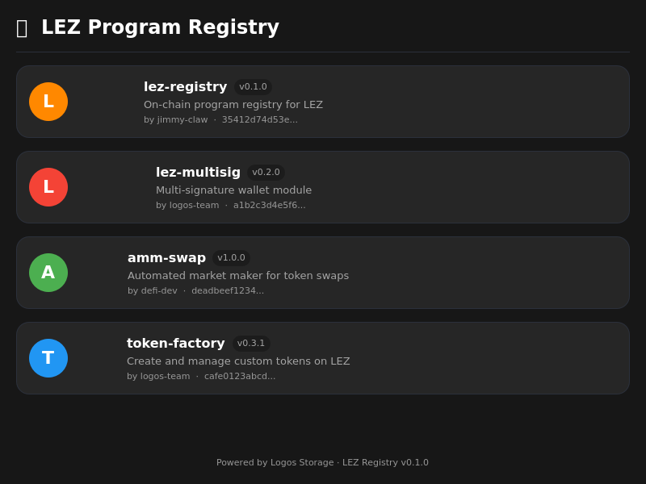

# LEZ Program Registry Module
n## Screenshot



A Logos Core Qt module for browsing, registering, and querying on-chain program metadata on the Logos Execution Zone.

**Full stack:** QML UI → Qt C++ Plugin → C FFI → Rust → Sequencer

## Architecture

```
┌─────────────────────────────────────────────┐
│  Logos Core (logoscore)                     │
│  ┌───────────────────────────────────────┐  │
│  │  logos_host subprocess                │  │
│  │  ┌─────────────────────────────────┐  │  │
│  │  │  liblez_registry_module.so      │  │  │
│  │  │  (Qt6 Plugin + QML UI)          │  │  │
│  │  │  ┌───────────────────────────┐  │  │  │
│  │  │  │  liblez_registry_ffi.so   │  │  │  │
│  │  │  │  (Rust → C FFI)           │  │  │  │
│  │  │  └───────────┬───────────────┘  │  │  │
│  │  └──────────────┼──────────────────┘  │  │
│  └─────────────────┼────────────────────┘  │
└────────────────────┼───────────────────────┘
                     │ JSON-RPC
                     ▼
              LEZ Sequencer
```

## Quick Start

### Prerequisites

- [Nix](https://nixos.org/download.html) with flakes enabled

### Build

```bash
# Clone
git clone git@github.com:jimmy-claw/logos-lez-registry-module.git
cd logos-lez-registry-module

# Build plugin only
nix build '.#lib' --extra-experimental-features 'nix-command flakes'

# Build standalone app (includes logoscore, logos_host, all deps)
nix build '.#app' --extra-experimental-features 'nix-command flakes'
```

### Test

```bash
# Test 1: Module loads without crash
QT_QPA_PLATFORM=offscreen ./result/bin/logoscore \
  --modules-dir ./result/modules \
  --load-modules liblez_registry_module

# Test 2: Call FFI through the full pipeline
QT_QPA_PLATFORM=offscreen ./result/bin/logoscore \
  --modules-dir ./result/modules \
  --load-modules liblez_registry_module \
  --call "liblez_registry_module.listPrograms({})"

# Test 3: Run standalone app (needs display or Xvfb)
./result/bin/logos-lez-registry-app
```

### Output Layout

```
result/
├── bin/
│   ├── logos-lez-registry-app   # Standalone Qt application
│   ├── logoscore                # Logos Core executable
│   └── logos_host               # Plugin host process
├── lib/
│   ├── liblogos_core.so         # Logos Core library
│   ├── liblogos_sdk.a           # Logos SDK
│   └── liblez_registry_ffi.so   # Rust FFI library
├── modules/
│   ├── capability_module_plugin.so
│   └── liblez_registry_module.so
└── qml/
    ├── LezRegistryView.qml      # Main registry browser
    ├── ProgramCard.qml           # Program list card
    ├── ProgramDetail.qml         # Program detail view
    └── RegisterForm.qml          # Program registration form
```

## QML Views

| View | Description |
|------|-------------|
| `LezRegistryView` | Main browser — lists registered programs with search |
| `ProgramCard` | Card component showing program name, version, author |
| `ProgramDetail` | Detail view with full metadata, IDL viewer |
| `RegisterForm` | Form to register a new program on-chain |

## FFI Functions

The module exposes these operations via C FFI:

| Function | Description |
|----------|-------------|
| `lez_registry_list` | List all registered programs |
| `lez_registry_get_by_id` | Get program by ID (PDA derivation) |
| `lez_registry_get_by_name` | Get program by name (requires indexer) |
| `lez_registry_register` | Register a new program |
| `lez_registry_update` | Update program metadata |
| `lez_storage_download` | Download from Logos Storage |
| `lez_storage_upload` | Upload to Logos Storage |
| `lez_storage_fetch_idl` | Fetch program IDL by CID |

## CI/CD

Every push to `main` triggers a GitHub Actions workflow that:
1. Builds both `.#lib` and `.#app` via Nix
2. Creates a GitHub Release with pre-built artifacts
3. PRs are build-tested without creating releases

## Related Repos

- [lez-registry](https://github.com/jimmy-claw/lez-registry) — Rust core + FFI + CLI
- [logos-liblogos](https://github.com/logos-co/logos-liblogos) — Logos Core framework
- [logos-cpp-sdk](https://github.com/logos-co/logos-cpp-sdk) — C++ SDK for modules

## License

MIT
